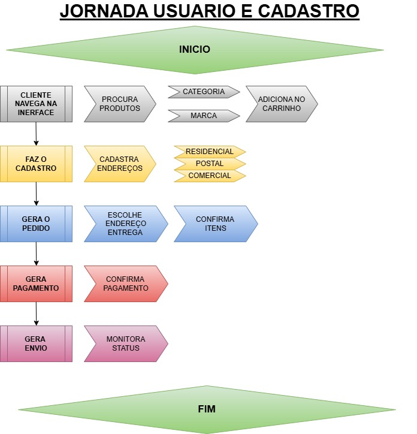
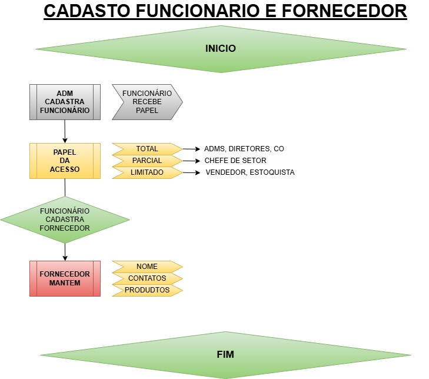
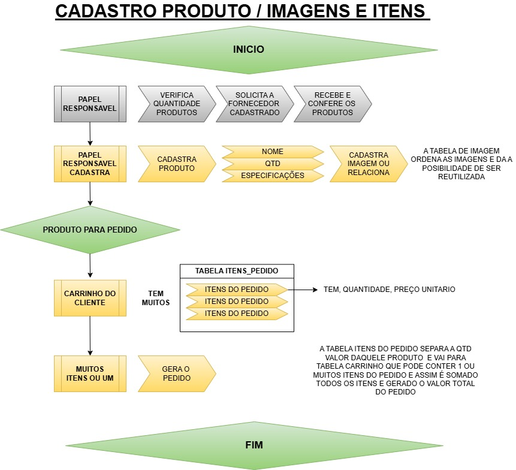

<h1 style="color:20B2AA;">
Sistema de gestão de e-commerce</h1>
<h3>Projeto acadêmico - Faculdade Cruzeiro do Sul </h3>

   

 

A <i><b>Eletro Santos</i></b> é um e-commerce especializado na venda de produtos eletroeletrôni-cos que conecta consumidores a uma ampla variedade de produtos de marcas confiá-veis. O sistema gerencia todo o ciclo de vendas, desde a navegação do cliente até a entrega final, integrando fornecedores, gestão de estoque e múltiplos métodos de pa-gamento.
O público-alvo são consumidores de tecnologia em geral, e o propósito principal é oferecer uma plataforma robusta e eficiente para a venda de produtos e gerenciamento de todo o ciclo do pedido.

## Documentos

  

  

   

 

## Tecnologias

  
  

  
<dr>

## Instalação

Para criação do banco de dados Eletro Santos

 Todas as tabelas clientes, enderecos, papeis, categorias, marcas, fornecedores, imagens, produtos, carrinhos, funcionarios, pedidos, imagens_produto, itens_pedido, pagamentos, envios. 
<i>Total: 15 tabelas.</i>

 <ul align="left">
 INSTRUÇÕES DE INSTALAÇÃO:
 <li>1 - Copie o código SQL que está aqui <a href="scripts_create_tables.sql">scripts_create_tables</a>
 <li>2 - Cole no editor do seu Aplicativo SQL <i> ex: MySQL Workbench, SQLite estudio ou PGAdmin</i>.
 <li>3 - Selecione tudo e <b>Excute o script SQL,</b> (seu programa ira criar o esquema com todas as tabelas).
 </ul>

 ## SCRIPTS

 <ul align="left">
<li>INSERTS: aqui <a href="scripts_inserts.sql" >scripts_inserts </a>mesmo procedimento (COPIAR,COLAR no EDITOR,EXECUTAR)</li>
<li>UPDATES:   aqui <a href="#" >## </a>mesmo procedimento (COPIAR,COLAR no EDITOR,EXECUTAR)</li>
<li>CONSULT:  aqui <a href="#" >## </a>mesmo procedimento (COPIAR,COLAR no EDITOR,EXECUTAR)</li>
<li>DELET:  aqui <a href="#" >## </a>mesmo procedimento (COPIAR,COLAR no EDITOR,EXECUTAR)</li>